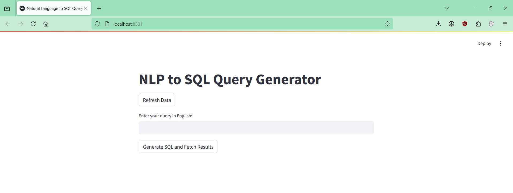
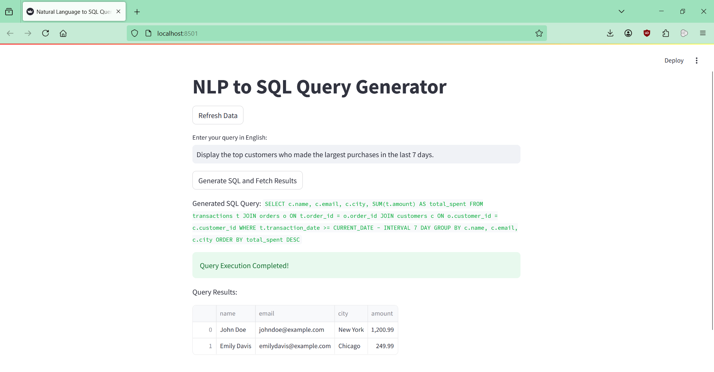

# NLP to SQL Query Generator using AWS

This project allows users to enter **natural language queries**, which are then **converted into SQL using Amazon Bedrock** and executed using **AWS Athena**. The results are fetched and displayed via a **Streamlit UI**.

---

## Features

- **Upload CSV files automatically** → AWS S3  
- **Automatic Table Creation** → AWS Glue Crawler  
- **Natural Language Query** → SQL using Amazon Bedrock
- **Execute SQL Queries** → AWS Athena
- **Fetch & Display Results** → Streamlit UI 

---

## Installation & Setup

### **1️. Install Dependencies**  
```sh
pip install -r requirements.txt
```

### **2. Deploy AWS Infrastructure**
```sh
cd terraform
terraform init
terraform apply -auto-approve
```

### **3. Upload CSV Files to S3**  
This happens **automatically** when running the app. If needed, upload manually:
```sh
python src/utils/s3_helper.py
```

### **4️. Run the App**  
#### **Option 1: Run via CLI**
```sh
python src/main.py
```

#### **Option 2: Run Streamlit UI**
```sh
streamlit run src/app.py
```

---

## How It Works

1️. Uploads **CSV files** to **S3**  
2️. AWS **Glue Crawler** detects schema and creates a **database**  
3️. Enter a **natural language query** in Streamlit  
4️. **Amazon Bedrock** converts it to SQL  
5️. **Athena** executes the SQL and returns results  

---




